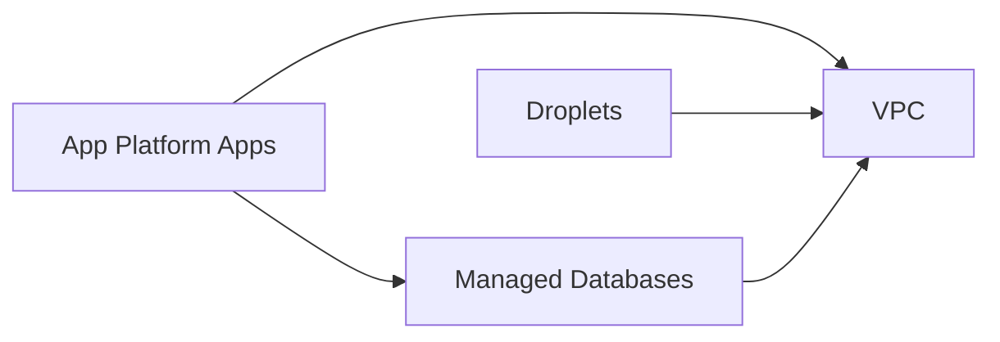

# koneksi-prod
IaC for koneksi production deployment on DigitalOcean.

## What This Deploys (Simplified)

### Networking
- One VPC in `sgp1` with a custom IP range.
- All resources attached to the `koneksi-prod` project.

### Droplets
- Three Ubuntu 22.04 droplets.
- Droplet-1 is Redis.
- Droplet-2/3 are for Vault (HA-ready).
- Reserved IP assigned to each droplet (stable public IPs).
- Password-based SSH enabled (no SSH keys).
- Redis installed/configured on droplet-1.

### Managed Databases
- PostgreSQL cluster (single node).
- MongoDB cluster (single node).
- Database `koneksi` created in both clusters.
- Firewalls allow access from:
  - Droplets
  - App Platform apps
  - Whitelisted public IPs

### App Platform
- Two GitHub apps:
  - `koneksi-backend`
  - `koneksi-log-viewer`
- Per-app instance size/count supported.
- Custom HTTP ports and health checks.
- VPC attached for private access to resources.

### State/Provider
- Terraform state stored in DigitalOcean Spaces (S3 backend).
- DigitalOcean provider.

## Diagrams

### High-Level (Minimal)


### Component-Only
```mermaid
flowchart TB
  subgraph Droplets
    D1[Droplet-1 (Redis)]
    D2[Droplet-2 (Vault)]
    D3[Droplet-3 (Vault)]
  end

  subgraph Databases
    PG[Postgres Cluster]
    MG[MongoDB Cluster]
  end

  subgraph Apps
    A1[koneksi-backend]
    A2[koneksi-log-viewer]
  end

  A1 --> PG
  A1 --> MG
  A2 --> PG
```

### Network-Focused
```mermaid
flowchart TB
  subgraph DO[DigitalOcean]
    VPC[VPC: koneksi-prod-vpc]
    Project[Project: koneksi-prod]

    subgraph Droplets
      D1[Droplet-1 (Redis)]
      D2[Droplet-2 (Vault)]
      D3[Droplet-3 (Vault)]
      RIP1[Reserved IP]
      RIP2[Reserved IP]
      RIP3[Reserved IP]
    end

    subgraph Databases
      PG[Postgres Cluster]
      MG[MongoDB Cluster]
    end

    subgraph Apps[App Platform]
      A1[koneksi-backend]
      A2[koneksi-log-viewer]
    end
  end

  Project --- VPC
  VPC --- D1
  VPC --- D2
  VPC --- D3
  D1 --- RIP1
  D2 --- RIP2
  D3 --- RIP3

  VPC --- PG
  VPC --- MG
  A1 --- PG
  A1 --- MG
  A2 --- PG
```
